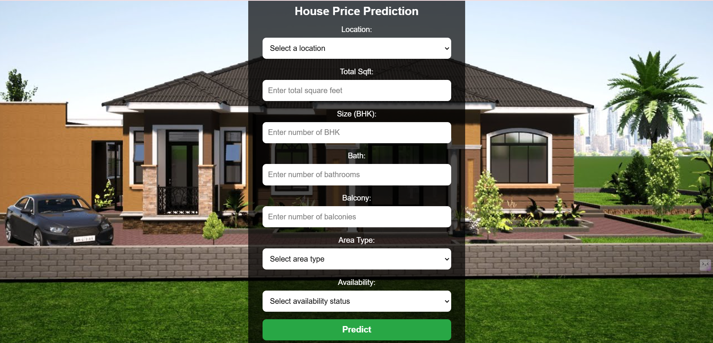
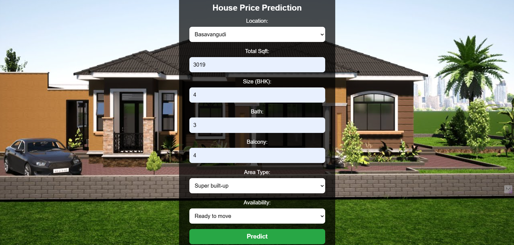
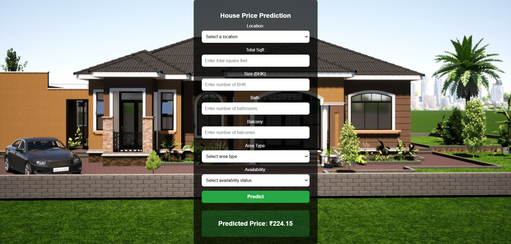

# 🏡 House Price Prediction Using Machine Learning

This project is a **House Price Prediction Web App** built with **Flask** and **Machine Learning**.  
It allows users to input various parameters like location, square footage, number of bedrooms, etc.,  
and predicts the estimated house price using a trained regression model.
## 📸 ** snapshots **

### Prediction Result

## 🚀 **Project Overview**
This project aims to predict house prices based on several features such as:
- **Location**  
- **Total Square Feet**  
- **Number of Bedrooms (BHK)**  
- **Number of Bathrooms**  
- **Number of Balconies**  
- **Area Type** (Super Built-up, Built-up, Plot Area, Carpet Area)  
- **Availability** (Ready to Move / Under Construction)

The project is divided into **two main parts**:
1. **Data Preprocessing & Model Training** → `train_model.py`
2. **Web App Development** → `app.py` (using Flask for deployment)

---

## 🛠 **Tech Stack**
- **Programming Language:** Python 🐍  
- **Framework:** Flask 🌐  
- **Machine Learning:** Scikit-Learn 🤖  
- **Data Processing:** Pandas & NumPy 📊  
- **Frontend:** HTML, CSS 🎨  

---

## 📂 **Dataset**
The dataset used in this project contains real estate data with features like:
- Location
- Square Feet
- BHK
- Number of Bathrooms
- Number of Balconies
- Price (Target variable)

📌 **Dataset File**: `Bengaluru_House_Data.csv`

---

## ✨ **Features**
✅ **User-friendly UI** built with HTML & CSS  
✅ **Dropdown-based location selection**  
✅ **Background Image for Better UI**  
✅ **Automated Data Cleaning & Feature Engineering**  
✅ **Model Deployment using Flask**  
✅ **Real-time House Price Predictions**  

## 🔧 **Installation**
### 1️⃣ Clone the Repository
git clone  https://github.com/Pawar1415/House-Price-Prediction-Web-App.git
cd House-Price-Prediction-Web-App

## 2️⃣ Create a Virtual Environment
python -m venv venv
source venv/bin/activate  # On Windows: venv\Scripts\activate

## 3️⃣ Install Dependencies
pip install -r requirements.txt

## 4️⃣ Run Model Training
python train_model.py

## 5️⃣ Start Flask App
python app.py

Then open http://127.0.0.1:5000/ in your browser.

📊 Model Training (train_model.py)
---
The train_model.py file performs:

- Data Cleaning & Preprocessing
- Feature Engineering (handling missing values, categorical encoding, etc.)
- Model Training (Linear Regression)
- Saving the Trained Model (model.pkl)

🔹 Handling total_sqft Column
---
- Some values are like "1200 - 1500".
- These are converted to the average (e.g., (1200+1500)/2 = 1350).

⚙️ How the Model Works
---
- User inputs house details on the webpage
- Flask receives the input and processes it
- Pre-trained model predicts the house price
- Predicted price is displayed on the webpage

🤝 Contributing
---
Feel free to Fork this repository and submit a Pull Request!
For major changes, open an issue first to discuss what you’d like to improve.

📜 License
This project is open-source under the MIT License.
---

